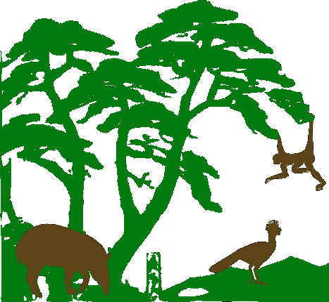

```{r}
#| echo: true
#| code-fold: true
#| warning: false
#| message: false
#| 
library(grateful)
library(readxl)
library(DT)
library(sf)
library(mapview)
library(maps)
library(tmap)
library(terra)
library(elevatr)
library(unmarked)
library(ubms)

library(tidyverse)

```


We want to Asses the role of Protected Areas (PA) in the conservation of vertebrates using on the ground data.

Evaluating whether PA are working is essential as they are perhaps the primary strategy for averting biodiversity loss.
Its been suggested that some do no work, paper parks
Its crucial to continue working on best methods to evaluate their impact.

Over a decade ago researchers started evaluating this.
Mostly focused on the effects of PA in reducing threats (fires, deforestation) and focused on forest cover.


Even if we are effective in protecting forests, and the forest is in very good condition, PA could have “empty forests” and loosed biodiversity (hunting, diseases or even their sizes). So when we say a PA is effective, are we looking at this?



::: {.callout-tip}
## Animals live inside the fores. The forest is not empty!
:::

 

We want to compare apples with apples and control for covariates related with occupancy and abundance of species, like elevation, human pressures, ecosystem type, etc.


Occupancy is a cost effective method for evaluation a population, it is a state variable, representing the proportion of the area occupied by the species, solving the problem of imperfect detection.  


We compiled deployments-studies that have intentionally sampled inside and outside PAS, in a quasi-experimental design, using camera traps. 

Each case each camera is adequately matched, in a similar fashion as the remote sensing approaches. 


We used a multispecies occupancy model, and a variation incorporating spatial autocorrelation, to compare occupancy inside and outside the PA and also as a distance to the protected area border. 


## Package Citation

```{r}
#| code-fold: true
pkgs <- cite_packages(output = "paragraph", pkgs="Session", out.dir = ".")
# knitr::kable(pkgs)
pkgs
```

## Sesion info

::: {.callout-note collapse=true}
```{r}
print(sessionInfo(), locale = FALSE)
```
:::

